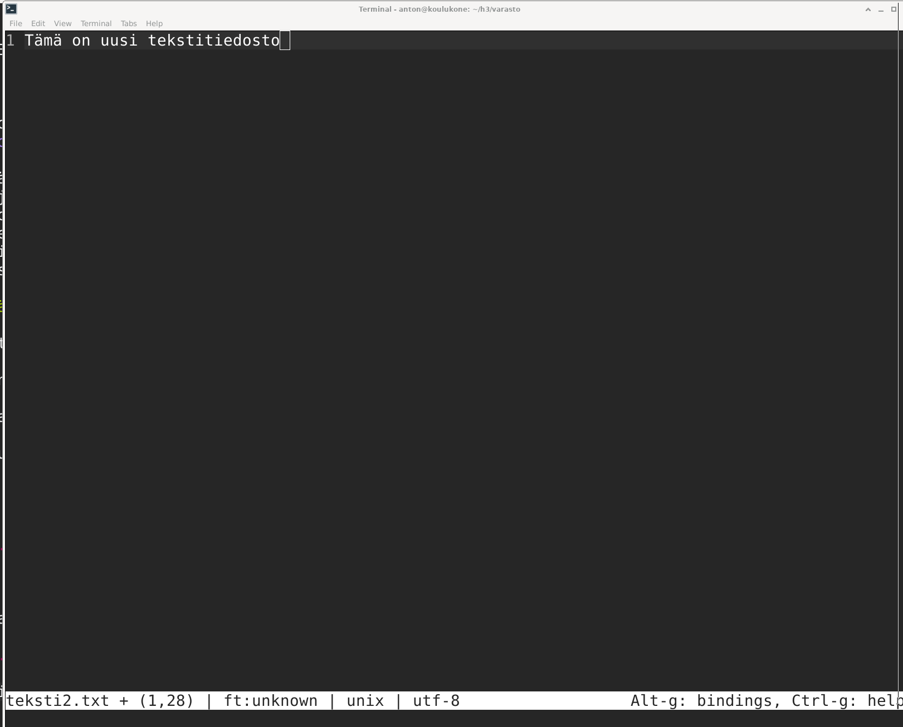

# h3 Versionhallinta

Tehtävät on tehty MacBook Prolla, jossa on käyttöjärjestelmänä MacOS Big Sur v.11.6. Linux Debian v.11.2.0 on asennettu VirtualBoxilla Tehtyyn virtuaalikoneeseen.

## z) Lue ja tiivistä artikkeli muutamalla ranskalaisella viivalla.

*italic* Tässä z-alakohdassa ei tarvitse siis tehdä testejä tietokoneella.
[Commonmark contributors: Markdown Reference](https://commonmark.org/help/)
 
- Ohjeet Markdownin käyttöön
- Otsikot luodaan kirjoittamalla rivin alkuun #, mitä useampi # on peräkkäin, sitä pienempi otsikko tehdään.
- Tab luo koodin kirjoittamista varten sisennyksen.
- Linkkiteksi kirjoitetaan hakasulkujen sisään ja linkin osoite kirjoitetaan sulkejensisään linkkitekstin jälkeen.
- Kuva liitetään samoin kuin linkki, mutta ennen hakasulkuja kirjoitetaan huutomerkki. Kuvan pitää olla tallennettuna samassa kansiossa, kuni markdown-tiedosto.
- Microlla kirjoittaessa näkee helposti milloin olen kirjoittanut merkit oikeaan paikkaan, sillä ne vaihtavat väriä. esim. kun kirjoitan # otsikko, niin tämä teksti näkyy vihreänä.

## a) MarkDown. Tee tämän tehtävän raportti MarkDownina.

Kirjoitin tämän raportin MarkDownina käyttäen microa.

Kuvakaappauksia varten asensin ohjelman scrot.

	$ sudo apt-get install scrot
	
Rajattujen kuvakaappausten ottaminen tapahtuu komennolla:

	$ scrot -s kuva.png
	

## b) Pull first. Tee useita muutoksia git-varastoosi. Tee muutama muutos, jossa yksi commit koskee useampaa tiedostoa. Anna hyvä kuvaukset (commit message), yksi englanninkielinen lause imperatiivissa (määräysmuodossa) "Add top level menu to Foobar synchronizer"

Minulla on jo olemassa "varasto"-niminen git-varasto. Varastossa on tiedostot README.md ja teksti.txt.

lisäsin tekstiä teksti.txt tiedostoon ja loin uudet tiedostot teksti2.txt ja juttu.md

	$ git add .
	$ git commit

Commitin kuvaukseksi annoin "Add text to teksti.txt. Add new files teksti2.txt and juttu.md"

## b) Kaikki kirjataan. Näytä omalla git-varastollasi esimerkit komennoista ‘git log’, ‘git diff’ ja ‘git blame’. Selitä tulokset.

	$ git log
	
	commit 3733be844eaa9daa1d5c40de354134c780d52c21 (HEAD -> master)
	Author: Anton Lagerstedt <lagerstedt.anton@gmail.com>
	Date:   Tue Apr 19 09:56:21 2022 +0300
	
	    Add text to teksti.txt. Add new files teksti2.txt and juttu.md
	
	commit fb0f36c77477ed145dd0866fa68bc7a055deeaa5
	Author: Anton Lagerstedt <lagerstedt.anton@gmail.com>
	Date:   Tue Apr 19 09:48:50 2022 +0300
	
	    Add README and teksti.txt

Loki näyttää versiohistorian. Author-kohdassa lukee muutoksen tekijä. Date-kohdassa taas lukee muutoksen ajankohta. Tämän alla lukee muutoksen tekijän antama kommentti muutoksista. Kommentti on englanniksi imperatiivissa ja presenssissä.

Loin uuden tiedoston teksti3.txt.

	$ git add . 

	$ git diff HEAD 
	
	diff --git a/teksti3.txt b/teksti3.txt
	new file mode 100644
	index 0000000..755e517
	--- /dev/null
	+++ b/teksti3.txt
	@@ -0,0 +1 @@
	+Tekstiä
	
Komento git diff HEAD näyttää muutokset, joita ei ole vielä kommentoitu.
Ensimmäinen rivi näyttää, että on tullut muutos koskien teksti3.txt-tiedostoa.
Toinen rivi kertoo, että kyseessä on uusi tiedosto.
Kolmanneksi alin rivi kertoo, että tiedostoon teksti3.txt on tullut uutta tekstiä ja alin rivi kertoo mitä uutta tekstiä on lisätty.

	$ git blame --incremental teksti.txt
	
	3733be844eaa9daa1d5c40de354134c780d52c21 3 3 2
	author Anton Lagerstedt
	author-mail <lagerstedt.anton@gmail.com>
	author-time 1650351381
	author-tz +0300
	committer Anton Lagerstedt
	committer-mail <lagerstedt.anton@gmail.com>
	committer-time 1650351381
	committer-tz +0300
	summary Add text to teksti.txt. Add new files teksti2.txt and juttu.md
	previous fb0f36c77477ed145dd0866fa68bc7a055deeaa5 teksti.txt
	filename teksti.txt
	fb0f36c77477ed145dd0866fa68bc7a055deeaa5 1 1 2
	author Anton Lagerstedt
	author-mail <lagerstedt.anton@gmail.com>
	author-time 1650350930
	author-tz +0300
	committer Anton Lagerstedt
	committer-mail <lagerstedt.anton@gmail.com>
	committer-time 1650350930
	committer-tz +0300
	summary Add README and teksti.txt
	boundary
	filename teksti.txt
	
Komento git blame --incremental teksti.txt kertoo pelkästään teksti.txt versiohistorian.
Author kohdassa lukee alkuperäisen tiedoston luoja.
Myöhemmät committer kohdat taas kertovat tehdyistä muutoksista. Niissä näkyy kuka muokkasi ja muokkaajan kommentti tehdyistä muutoksista.

## c) Huppis! Tee tyhmä muutos gittiin, älä tee commit:tia. Tuhoa huonot muutokset ‘git reset --hard’. Huomaa, että tässä toiminnossa ei ole peruutusnappia.

Avasin tiedoston juttu.md ja kirjoitin jutun juonen päälle roskaa ja tallensin.

	$ git reset --hard

Avasin uudestaan juttu.md:n ja sisältö oli palautunut aikaan ennen tyhmää muutostani.

## d) Formula. Tee uusi salt-tila (formula, moduli, infraa koodina). (Eli uusi tiedosto esim. /srv/salt/terontila/init.sls). Voit tehdä ihan yksinkertaisen parin funktion (pkg, file...) tilan, tai edistyneemmin asentaa ja konfiguroida minkä vain uuden ohjelman: demonin, työpöytäohjelman tai komentokehotteesta toimivan ohjelman. Käytä tarvittaessa ‘find -printf “%T+ %p\n”|sort’ löytääksesi uudet asetustiedostot.

Päätin tehdä yksinkertaisen salt-tilan, joka asentaa kolme usein käyttämääni ohjelmaa.
Loin uuden kansion kohteeseen /srv/salt/

	$ sudo mkdir favorite

Kansion nimi on favorite, ja se on myös tämän uuden salt-tilan nimi.
Kansion sisällä loin init.sls

	$ micro init.sls

Tiedoston sisällöksi kirjoitin:

	micro:
		pkg.installed
	
	pwgen:
		pkg.installed
	
	scrot:
		pkg.installed

Tämän salt tilan ajamalla saa asetettua kolme usein käyttämääni ohjelmaa uusille koneilleni. 
Nämä ohjelmat ovat:
- Micro - Erittäin hyvä editori, jota käytän mielummin kuin oletuseditori Nanoa.
- pwgen - Kätevä salasanojen luomistyökalu. Lähtökohtaisesti luon tällä kaikki salasanani.
- scrot - Ruudunkaappaus työkalu, jota voi käyttää helposti komentokehoitteessa.

