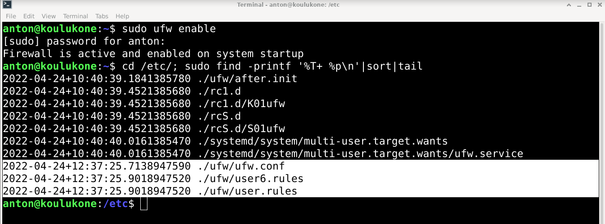
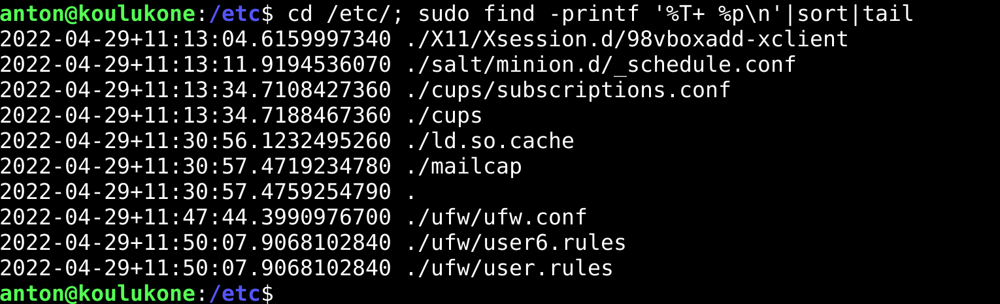
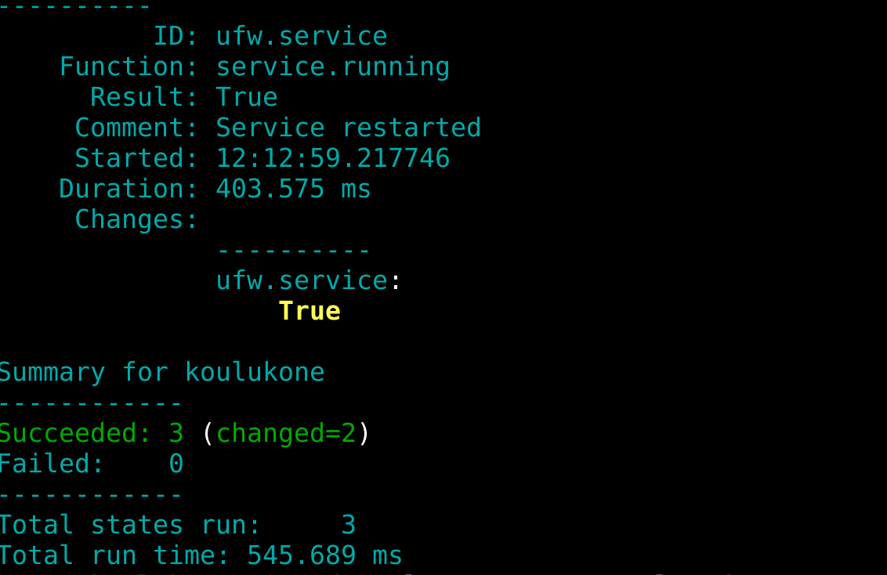
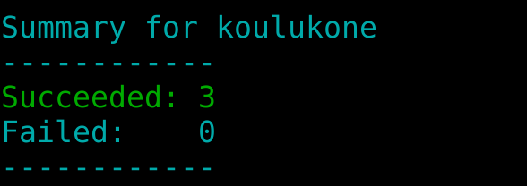
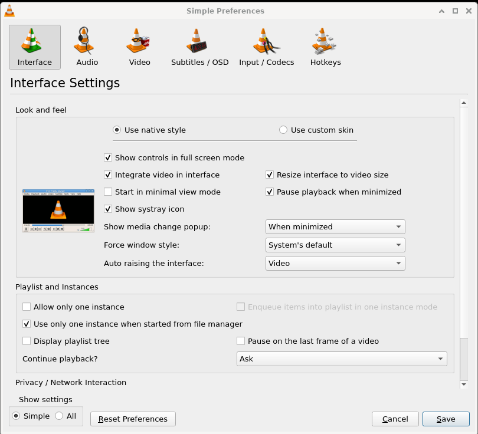
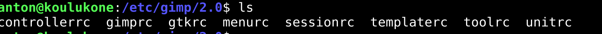

# h4 Aikajana

Tehtävät on tehty MacBook Prolla, jossa on käyttöjärjestelmänä MacOS Big Sur v.11.6. Linux Debian v.11.2.0 on asennettu VirtualBoxilla Tehtyyn virtuaalikoneeseen.

[Kotitehtävät](https://terokarvinen.com/2021/configuration-management-systems-2022-spring/)

## a) Captain obvious. Linuxissa on paketinhallinta, joten ohjelmien asentaminen on yksinkertaista. Tee tila, joka asentaa 10 suosikkiohjelmaasi paketinhallinnasta. Tässä a-kohdassa voit jättää ohjelmat oletusasetuksille.

*sunnuntai 24.4.2022 klo 10:05*

loin /srv/salt kansioon uuden kansion nimeltään paketti. Tämän kansion sisään loin tiedoston init.sls

	$ sudo mkdir paketti
	$ sudoedit init.sls

init.sls tiedoston sisällöksi kirjoitin seuraavan:

Tämä salt-tila asentaa nyt siis 10 usein käyttämääni ohjelmaa. 

Kokeilin komentoa.

	$ sudo salt '*' state.apply paketti

Sain virheilmoituksen:

Oletan että olin tehnyt kirjoitusvirheen init.sls tiedostoon. Olin käyttänyt sisennystä kahden välilyönnin sijaan.Korjasin virheen kaikkiin 10 riviin, jossa olin sen tehnyt ja ajoin komennon uudestaan. Nyt komento toimi oikein. Minulla oli jo viisi valitsemistani ohjelmista asennettuna, joten salt asensi vain ne viisi ohjelmaa, joita ei vielä ollut asennettuna koneelleni.

## b) CSI Pasila. Tiedostoista saa aikajanan 'cd /etc/; sudo find -printf '%T+ %p\n'|sort|tail'.

- Anna esimerkki aikajanasta
- Selitä jokainen kohta komennosta, jolla aikajana tehdään. Vinkki: '%T+' löytyy 'man find' kohdasta printf.
- Aja jokin komento, joka muuttaa järjestelmän yhteisiä asetustiedostoja
- Ota uusi aikajana ja etsi muutos sieltä
- Onko samalla hetkellä muutettu yhtä vai useampaa tiedostoa?

### Esimerkki aikajanasta

Ajoin annetun komennon.

		$ cd /etc/; sudo find -printf '%T+ %p\n'|sort|tail

Sain seuraavan vastauksen:

Aikajanasta näin, että viimeisimmät muutokset ovat koskeneet palomuurin asetuksia. Tämä johtuu siitä, että asensi palomuurin osana kohdan a) salt-tilaa.

### Selite komennosta, jolla aikajana tehdään

		$ cd /etc/; sudo find -printf '%T+ %p\n'|sort|tail

Alussa on komento cd /etc/ Tämä siirtyy kansioon, josta aikajana halutaan tehdä. Tässä kansio on /etc/, jossa on kaikki koko järjestelmää koskevat tiedostot.

; komennon jälkeen käskee tekemään toisen komennon ensimmäisen perään. Tämä toinen komento on:

	sudo find -printf '%T+ %p\n'|sort|tail

sudo tarkoittaa, että komento ajetaan sudona, eli superuser do:na. Eli pääkäyttäjänä. Vain käyttäjät, joilla on on sudo oikeudet voivat käyttää sudo komentoa.

find on on ohjelma, jolla etsitään tiedostoja.

-printf on tämän ohjelman toiminto, jolla tehdään aikajana. Loppuosa komennosta on parametreja, joilla kerrotaan minkälainen aikajana tehdään.

	'%T+ %p\n'|sort|tail

%T+ käskee esittämään aikajanan ajan muodossa vuosi.kuukausi.päivä+tunnit:minuutit:sekunnit 

%p listaa tiedostojen nimet ja \n käskee kirjoittamaan eritiedostot tulosteessa eri riveille.

	|sort|tail

sort järjestää tulosteen aakkosjärjestykseen, jossa numerot tulevat ennen kirjaimia. Koska aikajana on käsketty ilmloittamaan aika muodossa vuosi.kuukausi.päivä+tunnit:minuutit:sekunnit, tämä järjestää aikajanan myös aikajärjestykseen.

tail käskee näyttämään 10 viimeisintä muutosta. Tämä on kätevää, sillä usein etsimme viimeisimpiä muutoksia.

### Ajetaan uusi komento

*Sunnuntai 24.4.2022 klo 12:35*

Laitoin asentamani palomuurin päälle.

	$ sudo ufw enable 

Teens uuden aikajanan

		$ cd /etc/; sudo find -printf '%T+ %p\n'|sort|tail

Kuvassa on maalattuna rivit, jotka koskivat tätä palomuurin päälle laittoa. Komento $ sudo ufw enable siis muokkasi kolmea tiedostoa. Muokatut tiedostot oli helppo tunnistaa aikaleimasta.

### c) Tiedän mitä teit viime kesän^H^H^H komennolla. Säädä jotain ohjelmaa ja etsi sen muuttamat tiedostot aikajanasta. Tee sitten tästä oma Saltin tila.

*Perjantai 29.4.2022 klo 11:20*

Päätin muokata palomuurin asetuksia. Olin jo asentanut palomuurin (ufw), mutten ollut laittanut sitä päälle. Joten kytkin nyt palomuurin päälle.

	$ sudo ufw enable

Seuraavaksi ajoin aikajana komennon

	cd /etc/; sudo find -printf '%T+ %p\n'|sort|tail

Kolme alinta riviä kertovat muutoksista ufw:n asetuksiin. tiedosto ufw.conf sisältää ufw:n asetukset. Tiedoston sijainti on /etc/ufw/ufw.conf

Loin uuden kansion sijaintiin /srv/salt/ kansion nimeksi annoin ufw. Tämän kansion sisään loin tiedoston init.sls

	$ cd /srv/salt/
	$ sudo mkdir ufw
	$ cd ufw/
	$ sudoedit init.sls

Kopioin ufw.conf tiedoston samaan kansioon init.sls tiedoston kanssa.

	$ cd /etc/ufw/
	$ sudo cp ufw.conf /srv/salt/ufw/

Init.sls tiedoston sisällöksi kirjoitin:

	ufw:
	  pkg.installed
	
	/etc/ufw/ufw.conf:
	  file.managed:
	    - source: salt://ufw/ufw.conf
	
	ufw.service:
	  service.running:
	    - watch:
	      - file: /etc/ufw/ufw.conf
	
ufw: kohta käskee, että ufw tulee olla asennettuna. /etc/ufw/ufw.conf: - kohta käskee kopiomaan asetustiedoston salt-masterin kansiosta kohteeseen /etc/ufw/. Viimeinen kohta ufw.service käskee tarkistamaan että ufw demoni on käynnissä.

Seuraavaksi testasin salt-tilaa. sammutin ufw:n

	$ sudo ufw disable

Ajoin salt-tilan. virtuaalikoneeni on itse itsensä herra ja orja, joten ajoin salt-tilan aivan kuin ajaisin sen muille orjakoneille.

	$ sudo salt '*' state.apply ufw

Sain vastauksen, että tila toimi ja ufw käynnistettiin uudestaan.

Ajoin viellä salt-komennon uusiksi. Tällä kertaa muutoksia ei tehty, sillä ufw oli jo asennettuna ja päällä.

### d) Asenna jokin toinen ohjelma asetuksineen.

Asensin kuvankäsittelyohjelman Gimp. Avasin ohjelman graafisessa käyttöliittymässä. Muutin asetuksista thumbnail kuvien kokoa ja talletin asetukset. Seuraavaksi katsoin löydänkö muutetut tiedostot aikajanasta.

	cd /etc/; sudo find -printf '%T+ %p\n'|sort|tail
	
Yllätyin, että aikajanalla ei näkynyt mitään muutoksia mihinkään Gimpin tiedostoihin /etc/ kansiossa. Eikä näkynyt muitakaan muutoksia siltä ajalta, kun muokkasin Gimpin asetuksia. Tarkistin /etc/gimp kansion sisällön.

Huomasin, että täällä on gimpin asetustiedostot. Kaiken järjen mukaan tekemäni asetusmuutokset muuttivat jotain näistä tiedostoista. En tiedä miksi aikajana ei näyttänyt tätä muutosta. Graafisessa käyttöliittymässä näen kuitenkin, että asetuksiin tekemäni muutokset ovat voimassa. 

