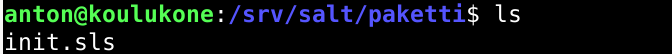
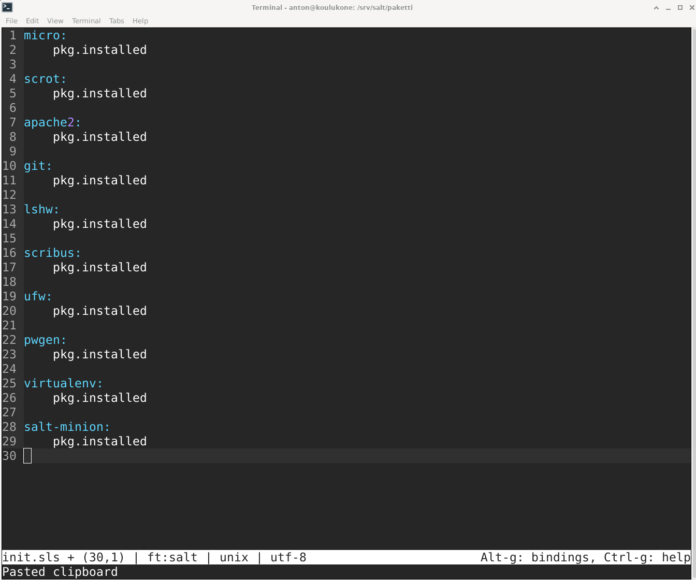
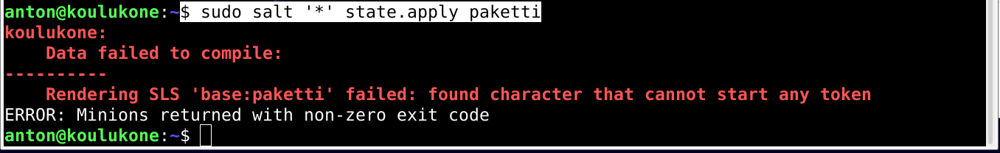
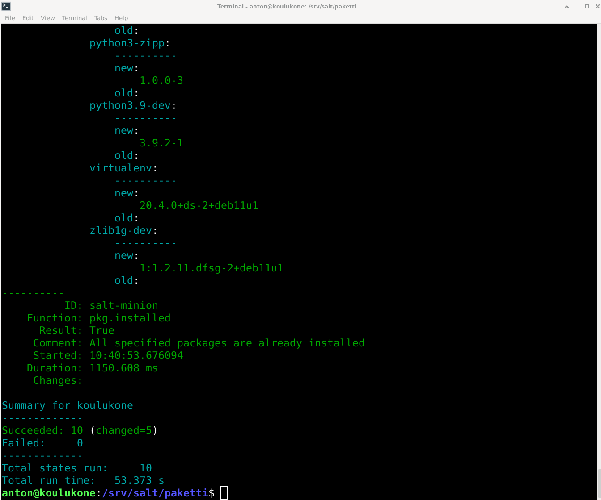
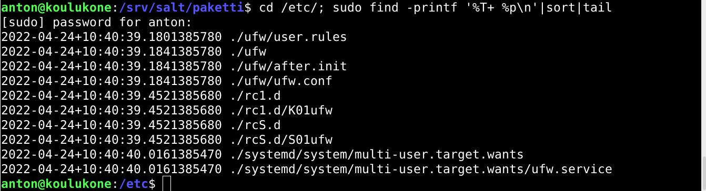

# h4 Aikajana

Tehtävät on tehty MacBook Prolla, jossa on käyttöjärjestelmänä MacOS Big Sur v.11.6. Linux Debian v.11.2.0 on asennettu VirtualBoxilla Tehtyyn virtuaalikoneeseen.

[Kotitehtävät](https://terokarvinen.com/2021/configuration-management-systems-2022-spring/)

## a) Captain obvious. Linuxissa on paketinhallinta, joten ohjelmien asentaminen on yksinkertaista. Tee tila, joka asentaa 10 suosikkiohjelmaasi paketinhallinnasta. Tässä a-kohdassa voit jättää ohjelmat oletusasetuksille.

*sunnuntai 24.4.2022 klo 10:05*

loin /srv/salt kansioon uuden kansion nimeltään paketti. Tämän kansion sisään lin tiedoston init.sls

	$ sudo mkdir paketti
	$ sudoedit init.sls

init.sls tiedoston sisällöksi kirjoitin seuraavan:

Tämä salt-tila asentaa nyt siis 10 usein käyttämääni ohjelmaa. 

Kokeilin komentoa.

	$ sudo salt '*' state.apply paketti

Sain virheilmoituksen:

Oletan että olin tehnyt kirjoitusvirheen init.sls tiedostoon. Olin käyttänyt sisennystä kahden välilyönnin sijaan.Korjasin virheen kaikkiin 10 riviin, jossa olin sen tehnyt ja ajoin komennon uudestaan. Nyt komento toimi oikein. Minulla oli jo viisi valitsemistani ohjelmista asennettuna, joten salt asensi vain ne viisi ohjelmaa, joita ei vielä ollut asennettuna koneelleni.

## b) CSI Pasila. Tiedostoista saa aikajanan 'cd /etc/; sudo find -printf '%T+ %p\n'|sort|tail'.

- Anna esimerkki aikajanasta
- Selitä jokainen kohta komennosta, jolla aikajana tehdään. Vinkki: '%T+' löytyy 'man find' kohdasta printf.
- Aja jokin komento, joka muuttaa järjestelmän yhteisiä asetustiedostoja
- Ota uusi aikajana ja etsi muutos sieltä
- Onko samalla hetkellä muutettu yhtä vai useampaa tiedostoa?

### Esimerkki aikajanasta

Ajoin annetun komennon.

		$ cd /etc/; sudo find -printf '%T+ %p\n'|sort|tail

Sain seuraavan vastauksen:

Aikajanasta näin, että viimeisimmät muutokset ovat koskeneet palomuurin asetuksia. Tämä johtuu siitä, että asensi palomuurin osana kohdan a) salt-tilaa.

### Selite komennosta, jolla aikajana tehdään

		$ cd /etc/; sudo find -printf '%T+ %p\n'|sort|tail

Alussa on komento cd /etc/ Tämä siirtyy kansioon, josta aikajana halutaan tehdä. Tässä kansio on /etc/, jossa on kaikki koko järjestelmää koskevat tiedostot.

; komennon jälkeen käskee tekemään toisen komennon ensimmäisen perään. Tämä toinen komento on:

	sudo find -printf '%T+ %p\n'|sort|tail

sudo tarkoittaa, että komento ajetaan sudona, eli superuser do:na. Eli pääkäyttäjänä. Vain käyttäjät, joilla on on sudo oikeudet voivat käyttää sudo komentoa.

find on on ohjelma, jolla etsitään tiedostoja.

-printf on tämän ohjelman toiminto, jolla tehdään aikajana. Loppuosa komennosta on parametreja, joilla kerrotaan minkälainen aikajana tehdään.

	'%T+ %p\n'|sort|tail

%T+ käskee esittämään aikajanan ajan muodossa vuosi.kuukausi.päivä+tunnit:minuutit:sekunnit 

%p listaa tiedostojen nimet ja \n käskee kirjoittamaan eritiedostot tulosteessa eri riveille.

	|sort|tail

sort järjestää tulosteen aakkosjärjestykseen, jossa numerot tulevat ennen kirjaimia. Koska aikajana on käsketty ilmloittamaan aika muodossa vuosi.kuukausi.päivä+tunnit:minuutit:sekunnit, tämä järjestää aikajanan myös aikajärjestykseen.

tail käskee näyttämään 10 viimeisintä muutosta. Tämä on kätevää, sillä usein etsimme viimeisimpiä muutoksia.

### Ajetaan uusi komento

	
