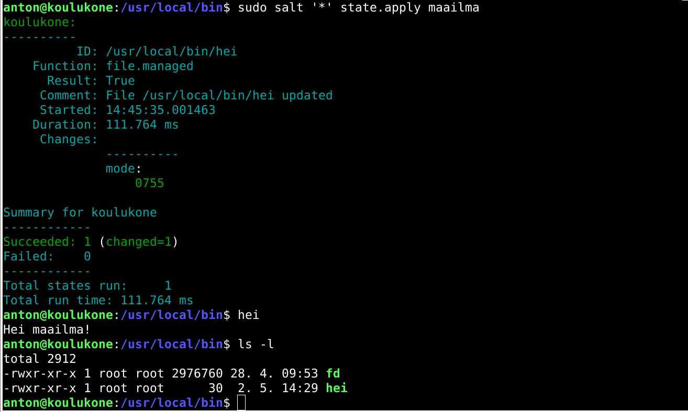
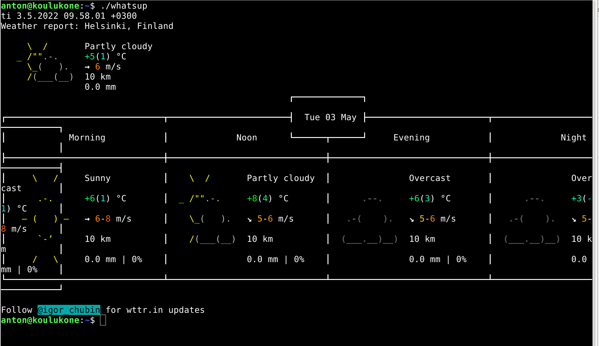
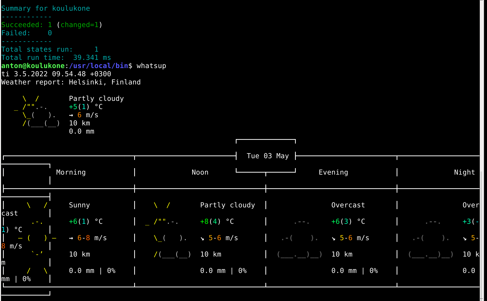
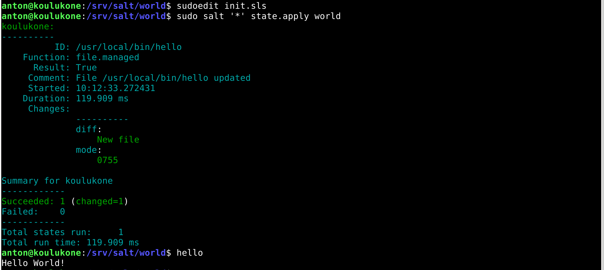
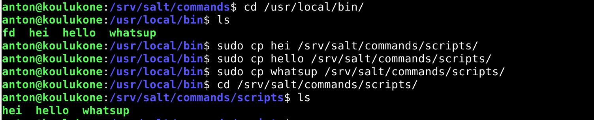
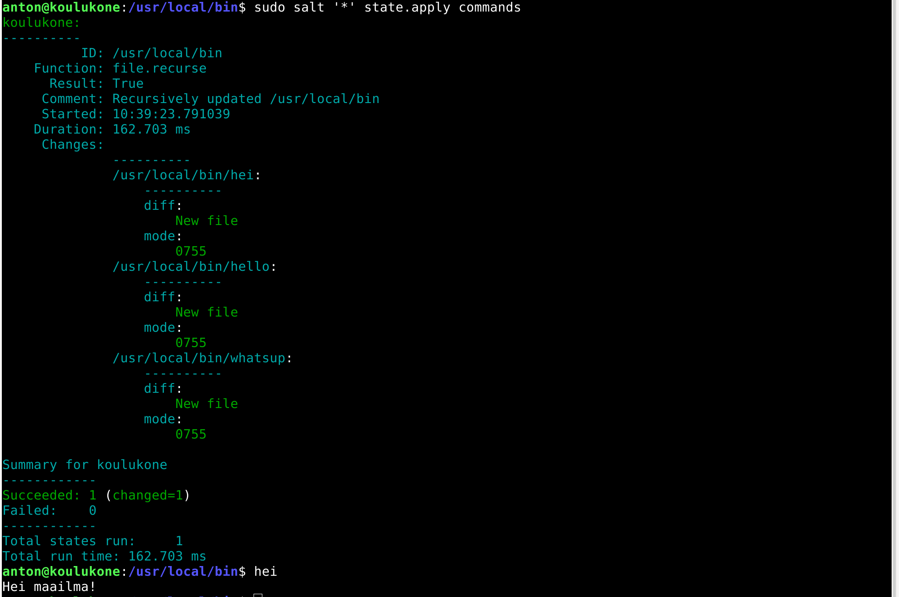

# h5 Uusi komento

[Kotitehtävät](https://terokarvinen.com/2021/configuration-management-systems-2022-spring/)

Tehtävät on tehty MacBook Prolla, jossa on käyttöjärjestelmänä MacOS Big Sur v.11.6. Linux Debian v.11.2.0 on asennettu VirtualBoxilla Tehtyyn virtuaalikoneeseen.

## a) Hei komento! Tee järjestelmään uusi "hei maailma" -komento ja asenna se orjille Saltilla. 

Loin uuden tekstitiedoston nimeltään hei

	$ micro hei

Tiedoston sisällöksi kirjoitin echo Hei maailma!. 

Voin ajaa tämän komennon bashilla

	$ bash hei

Tämä tulostaa teksin "Hei maailma!"

Jotta minun ei tarvitse komentoa ajaessani kirjoittaa alkuun bashia, lisäsin hei tiedoston alkuun seuraavan rivin:

	#!/bin/bash

Lisäsin komennolle käyttöoikeudet, niin että kaikki käyttäjät saavat ajaa sen

	$ chmod a+x hei

Kopioin tiedoston kansioon /usr/local/bin/

	$ sudo cp hei /usr/local/bin/

Tarkistin, että oikeudet ovat oikein ajamalla komennon ls -l kansiossa /usr/local/bin/

Oikeudet näyttävät olevan oikein. -rwxr-xr-x kertoo käyttöoikeuksista. Kolmas kohta on kaikkia koskevat oikeudet. siinä lukee vain x. Tämä tarkoittaa että kaikilla käyttäjillä on oikeuksinaan ajaa komento. rw(kirjoita) ja r(lue) oikeudet ovat vain root käyttäjillä.

Sitten tein tästä salt-tilan.

loin kansioon /srv/salt/ kansion maailma

	$ sudo mkdir maailma

Kopioin tähän kansioon juuri tekemäni hei-tiedoston.

	$ cd /usr/local/bin/; sudo cp hei /srv/salt/maailma/

Loin init.sls tiedoston tähän samaan kansioon. Sisällöksi kirjoitin:

	/usr/local/bin/hei:
	  file.managed:
	    - source: salt://maailma/hei

Kokeilin, että salt-tilan pystyi ajamaan

	$ sudo salt '*' state.apply maailma

Tämä onnistui, eli en ollut tehnhyt kirjoitusvirheitä init.sls tiedostossa. Tila ei kuitenkaan tehnyt mitään muutoksia /usr/local/bin kansioon, sillä siellä oli jo hei tiedosto. Poistin tiedoston hei orjakoneen kansiosta /usr/local/bin. Kokeilin tämän jälkeen ajaa komentoa hei. Tämä ei enää toiminut. Tarkistin korjaako salt-tilani tämän tilan ajamalla salt-komennon uusiksi. 

Tila toimi, mutta hei komennon käyttöoikeudet eivät menneet oikein. 

Lisäsin init.sls tiedostoon rivit koskien käyttöoikeuksia.
Nyt init.sls tiedoston sisältö on seuraava:

	/usr/local/bin/hei:
	  file.managed:
	    - source: salt://maailma/hei
	    - user: root
	    - group: root
	    - mode: 0755

Ajoin salt tilan uusiksi ja testasin toimiko nyt oikein.

Nyt toimi oikein. 

## b) whatsup.sh. Tee järjestelmään uusi komento, joka kertoo ajankohtaisia tietoja; asenna se orjille. Vinkkejä: Voit näyttää valintasi mukaan esimerkiksi päivämäärää, säätä, tietoja koneesta, verkon tilanteesta...

Halusin tehdä komennon, joka kertoo päivämäärän ja sään.

Loin uuden tiedoston nimeltään whatsup

	$ micro whatsup

Tiedoston sisään kirjoitin seuraavat tiedot:

	#!/bin/bash

Tämä kertoo, että tiedosto ajetaan bashilla.
	
	date

Tämä on komento, joka kertoo päivämäärän ja ajan

	curl wttr.in?M1

curl wttr.in kertoo paikallisen sään. Kysymysmerkin jälkeen tulevat parametrit M ja 1. M käskee ilmoittamaan tuulen nopeuden muodossa m/s ja 1 käskee näyttämään vain yhden päivän tiedot.

Lisäsin käyttöoikeudet tiedostolle

	$ chmod a+x whatsup

Testasin että komento toimi

	$ ./whatsup

Komento toimi.

Kopioin tiedoston kansioon /usr/local/bin/

	$ sudo cp whatsup /usr/local/bin/

Tein tästä salt-tilan. Tein kansion whatsup kansioon /srv/salt/

	$ cd /srv/salt/; sudo mkdir whatsup

Kopioin whatsup tiedoston tähän kansioon

	$ sudo cp whatsup /srv/salt/whatsup/

Kansion sisälle loin init.sls tiedoston.

	$ sudoedit init.sls

Tiedoston sisällöksi kirjoitin:

	/usr/local/bin/whatsup:
	  file.managed:
	    - source: salt://whatsup/whatsup
    	- user: root
		- group: root
		- mode: 0755

Testasin ajaa salt-tilan

	$ sudo salt '*' state.apply whatsup

Tila toimi, mutta ei tehnyt muutoksia, sillä whatsup tiedosto oli jo kansiossa /usr/local/bin/. Tarkistin tällä kuitenkin, että salt-tilassani ei ollut virheitä.

Poistin whatsup tiedoston /usr/local/bin/ kansiosta. Nyt whatsup komento ei enää toimi. Ajoin salt-tilan uudestaan. Kokeilin komentoa uudestaan. Nyt toimi.

## c) hello.py. Tee järjestelmään uusi komento Pythonilla ja asenna se orjille.

Loin tiedoston hello. Tiedoston sisällöksi:

	#!/usr/bin/python3
	
	print("Hello World!")

Loin uuden salt-tilan tästä.

Loin kansion /srv/salt/world/ ja kopioin tiedoston hello tähän kansioon. Tein tiedoston init.sls, jonka sisällöksi kirjoitin:

	/usr/local/bin/hello:
	  file.managed:
	    - source: salt://world/hello
	   	- user: root
		- group: root
		- mode: 0755

Ajoin salt-tilan ja kokeilin, että hello komento toimi.

## d) Laiskaa skriptailua. Tee kansio, josta jokainen skripti kopioituu orjille. 

Loin uuden salt-tilan nimeltään commands

	$ cd /srv/salt/
	$ sudo mkdir commands

Tein kansion scriptejä varten tähän kansioon

		$ sudo mkdir scripts

Kopioin aiemmissa tehtävissä tekemäni komennot scripts kansioon.

Loin init.sls tiedoston commands kansioon

	$ sudoedit init.sls

Tiedoston sisällöksi kirjoitin:

	/usr/local/bin:
	  file.recurse:
	    - source: salt://commands/scripts
	    - user: root
	    - group: root
	    - dir_mode: 0755
	    - file_mode: 0755

Poistin hei, hello ja whatsup tiedostot kansiosta /usr/local/bin/. Ajoin salt-tilan, ja tarkistin toimivatko komennot.

Toimi oikein. Jatkossa jos haluan lisätä jonkin komennon kaikille orjakoneille, kopioin komennon kansioon /srv/salt/commands/scripts/. Ja ajan tämän jälkeen commands salt-tilan.

## e) Intel. Etsi kolme loppuprojektia joltain vanhalta kurssitoteutukselta. Kuvaile projektit tiiviisti ja linkitä alkuperäiseeen raporttin. 

[Toni Sepän projekti vuodelta 2018](https://github.com/tontsa00/projectwork)

- Projektin ideana oli asentaa saltilla orjille useita tarpeellisia ohjelmia ja konfiguroida niiden asetukset oikein.
- Orjakoneet olivat käyttivät Linux ja Windows käyttöjärjestelmiä.
- Asennetut ohjelmat olivat:
	- Firefox www-selain
	- Thunderbird sähköpostiohjelma
	- Gimp kuvankäsittelyohjelma
	- VLC multimedia soitin ohjelma
	- 7zip pakkaushallintaohjelma
	- Git Github repository ohjelman

- Projekti vaikutti mielenkiintoiselta. Raportti oli kirjoitettu hyvin ja joka asia tuntui olevan dokumentoitu. Kuvakaappaukset tosin olisivat olleet kiva lisä.

[Tuuli Huhtan projekti vuodelta 2021](https://github.com/tuuli-huhtanen/palvelintenhallinta/blob/main/h7-omamoduuli.md)

- Projektin ideana on asentaa Tuulin käyttämät ohjelmat asennuksineen uutta konetta silmällä pitäen.

- Asennettavat ohjelmat ja asetukset olivat:
	- Bash completion
    - Tree
    - Net-tools
    - Git
    - Nanon konfigurointi
    - SSH:n konfiguraatiot
    - Palomuuriasetukset päälle ja porttien avaukset

- Raportista käy hyvin ilmi eri työvaiheet ja ajatustyö projektin takaa.

[Teemu Karhusen projekti vuodelta 2020](https://teemukarhunencom.wordpress.com/2020/12/14/h7-oma-moduli/)

- Projektin ideana on asentaa orjakoneille yleishyödylliset ohjelmat
- Asennetut ohjelmat:
	- Apache2
	- openssh
	- ufw

- Projekti on hyvin simppeli, mutta käyttökelpoinen.
- Raportti Wordpressissä ei tunnu yhtä hyvältä kuin markdown raportti guthubissa.
