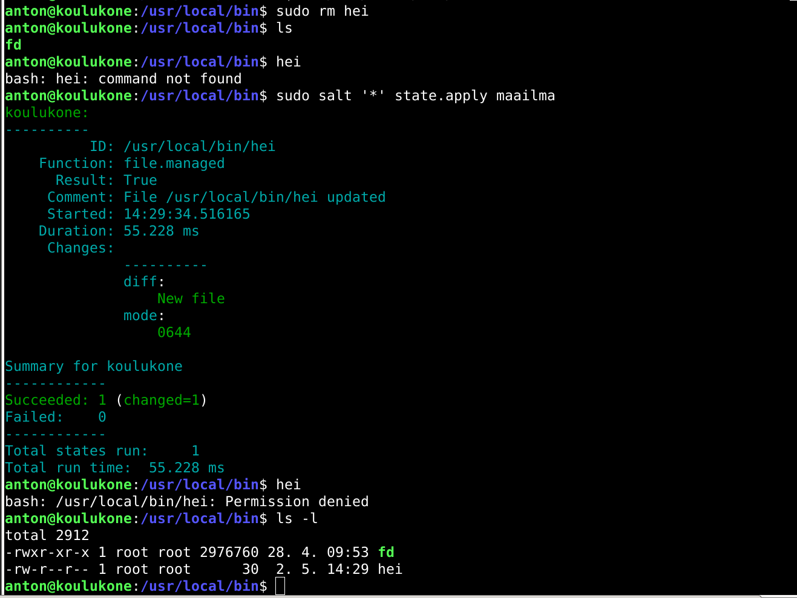

# h5 Uusi komento

Tehtävät on tehty MacBook Prolla, jossa on käyttöjärjestelmänä MacOS Big Sur v.11.6. Linux Debian v.11.2.0 on asennettu VirtualBoxilla Tehtyyn virtuaalikoneeseen.

## a) Hei komento! Tee järjestelmään uusi "hei maailma" -komento ja asenna se orjille Saltilla. 

Loin uuden teksti tiedoston nimeltään hei

	$ micro hei

Tiedoston sisällöksi kirjoitin echo Hei maailma!. 

Voin ajaa tämän komennon bashilla

	$ bash hei

Tämä tulostaa teksin "Hei maailma!"

Jotta minun ei tarvitse komentoa ajaessani kirjoittaa alkuun bashia, lisäsin hei tiedoston alkuun seuraavan rivin:

	#!/bin/bash

Lisäsin komennolle käyttöoikeudet, niin että kaikki käyttäjät saavat ajaa sen

	$ chmod a+x hei

Kopioin tiedoston kansioon /usr/local/bin/

	$ sudo cp hei /usr/local/bin/

Tarkistin, että oikeudet ovat oikein ajamalla komennon ls -l kansiossa /usr/local/bin/

Oikeudet näyttävät olevan oikein. -rwxr-xr-x kertoo käyttöoikeuksista. Kolmas kohta on kaikkia koskeval oikeudet. siinä lukee vain x. Tämä tarkoittaa että kaikilla käyttäjillä on oikeuksinaan ajaa komento. rw(kirjoita) ja r(lue) oikeudet ovat vain root käyttäjillä.

Sitten tein tästä salt-tilan.

loin kansioon /srv/salt/ kansion maailma

	$ sudo mkdir maailma

Kopioin tähän kansioon juuri tekemäni hei-tiedoston.

	$ cd /usr/local/bin/; sudo cp hei /srv/salt/maailma/

Loin init.sls tiedoston tähän samaan kansioon. Sisällöksi kirjoitin:

	/usr/local/bin/hei:
	  file.managed:
	    - source: salt://maailma/hei

Kokeilin, että salt-tilan pystyi ajamaan

	$ sudo salt '*' state.apply maailma

Tämä onnistui, eli en ollut tehnhyt kirjoitusvirheitä init.sls tiedostossa. Tila ei kuitenkaan tehnyt mitään muutoksia /usr/local/bin kansioon, sillä siellä oli jo hei tiedosto. Poistin tiedoston ja ajoin salt-tilan uudestaan.

kokeilin tämän jälkeen ajaa komentoa hei. Tämä ei enää toiminut. Tarkistin korjaako salt-tilani tämän tilan ajamalla salt-komennon uusiksi. 

Tila toimi, mutta hei komennon käyttöoikeudet eivät menneet oikein. 

