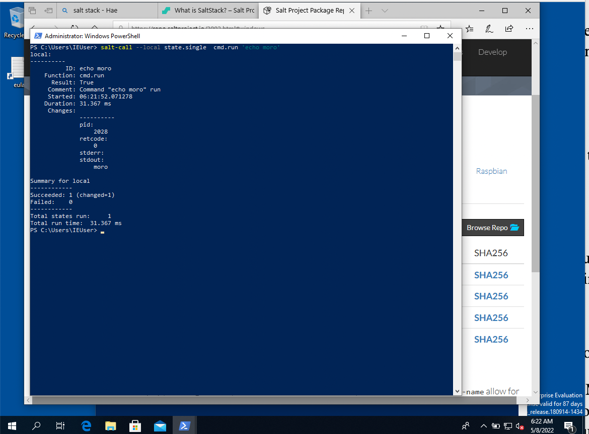
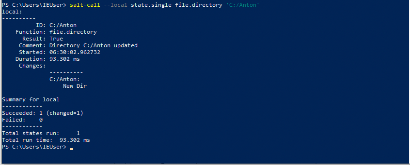
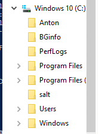
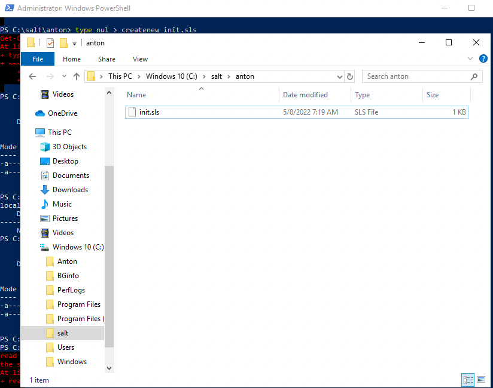
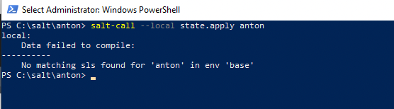

# h6 Akkuna

[Kotitehtävät](https://terokarvinen.com/2021/configuration-management-systems-2022-spring/)

Tehtävät on tehty MacBook Prolla, jossa on käyttöjärjestelmänä MacOS Big Sur v.11.6. Linux Debian v.11.2.0 on asennettu VirtualBoxilla Tehtyyn virtuaalikoneeseen.

## v) Lue ja tiivistä artikkeli muutamalla ranskalaisella viivalla. Tässä z-alakohdassa ei tarvitse siis tehdä testejä tietokoneella.

Karvinen 2018: [Control Windows with Salt](https://terokarvinen.com/2018/04/18/control-windows-with-salt/)

- Ohjeet Windowsin käyttöön salt-orjana.
- Master ja slave koneilla tulee olla sama versio saltista.
- Windowsilla ei ole omaa pakentinhallintaa, joten pitää käyttää esim Chocolatey -pakettivarastoa.
- Jos käyttää ilmaista Windows-virtuaalikonetta, suomenkielisen näppäimistön saa käyttöön komennolla:

	Set-WinUserLanguageList -LanguageList fi-FI -Force

## a) Suolaikkuna. Asenna Salt Windowsiin. Näytä testillä (test.ping, file.managed tms), että Salt toimii.

Asensin ilmaisen Windows virtuaalikoneen osoitteesta [modern.ie](https://developer.microsoft.com/en-us/microsoft-edge/tools/vms/) 

*Tämä virtuaalikone toimii äärimmäisen hitaasti hyvin pienellä näytöllä ja on suorastaan tuskaa käyttää. Eli soveltuu juuri ja juuri muutaman yksinkertaisen harjoituksen tekoon, mutta ei ole tehokas tapa käyttää Windowsia.*

Asensin saltin osoitteesta https://repo.saltproject.io/3002.html#windows. Valitsin Salt-Minion-3002.8-1Py3-AMD-Setup.exe -tiedoston ja ajoin sen. 

Painamalla windos+x sain auki valikon, josta valitsin kohdan Windows PowerShell (Admin). Tämä avasi PweroShell ikkunan, jossa voin ajaa komentoja adminina. Windowsissa en siis käytä Linuxista tyypillistä sudo-komentoa. 

Testasin salttia kirjoittamalla:

	salt-call --local cmd.run 'echo Moro!'

Sain  vastaukseksi :

	local:
		Moro!

Salt siis toimi.

## b) Single. Näytä komentorivillä Saltilla (state.single) esimerkit funktioista file ja cmd.

Ajoin komennon:

	salt-call --local state.single cmd.run 'echo Moro!'

Vastauksesta näin, että komento toimi. Komento ei kuitenkaan ollut idempotentti, joten sen ajaminen uudestaan johtaisi samaan lopputulokseen:Succeeded: 1 (changed=1)

Seuraavaksi kokeilin file funktiota. Loin uuden kansion C:/Anton.

	salt-call --local state.single file.directory 'C:/Anton'

Komento toimi, vaikka kenoviivan sijaan käytin kauttaviivaa. Tarkistin vielä, että tekemäni kansio oikeasti löytyy koneelta.

## c) IaCcuna. Tee Windowsissa infraa koodina, ja aja se paikallisesti (salt-call --local state.apply foo)

Tein kansion Anton kohteeseen C:/salt. En tiennyt komentorivi komentoa Windowsille, jolla luodaan uusia tiedostoja. Google ei myöskään auttanut. Kokeilen useita eri komentoja mm. createnew, nul >, write. Mutta mikään näistä komennoista ei toiminut. Loin uudenteksti tiedoston käyttäen graafista käyttöliittymää. Sisällöksi laitoin:

	C:/Anton2:
	  - file.directory

Tämän pitäisi siis luoda uusi kansio Anton2 C:n juureen.

Annoin tiedostolle nimen init.sls

Testasin salt-tilaa komennolla:

	salt-call --local state.apply anton

Ei toiminut. Sopivaa sls-tiedostoa ei löytynyt. En tiedä mihin tiedosto tulisi tallentaa Windowsilla. Jäin tämän tehtävän osalta umpikujaan.

## e) Goal. Tee projektisi palautussivu. Voit tehdä sen GitHubiin, kotisivullesi tai mihin vain haluat. Mistä teet miniprojektin? Kuvaile miniprojektin tarkoitus lauseella tai parilla. Asenna käsin (jokin alustava osa) projektistasi ja ota ruutukaappaus siitä, miten lopputulosta käytetään.

Loin uuden Github repositoryn nimeltään starterkit

[starterkit](https://github.com/AntonLagerstedt/starterkit)

Starterkit on siis projektini nimi. Starterkitin on tarkoitus auttaa minua uuden Linux-koneen asentamisen kanssa. Projekti asentaa usean minun hyväksi havaitsemani ohjelman asetustiedostoineen ja lisää ainakin yhden komennon kaikille käyttäjille.

Valitsin projektille lisenssiksi GNU GENERAL PUBLIC LICENSE Version 2, sillä halusin että projektiani saa käyttää kuka tahansa omiin tarkoituksiinsa ja vapaasti kehittää haluamaansa suuntaan.

Loin "timeline" komennon ja laitoin siitä esimerkki kuvakaappauksen projektin README tiedostoon.

