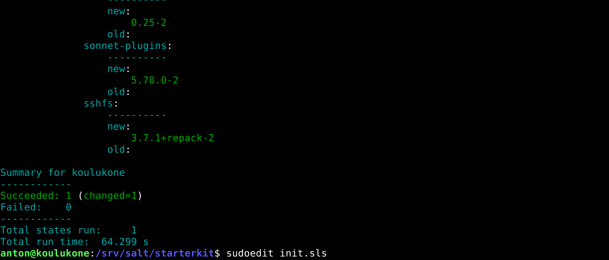
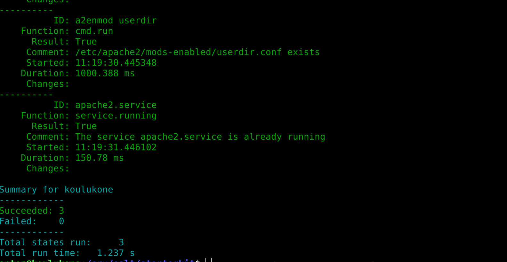
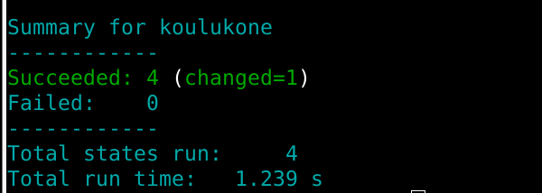

# h7 Oma moduli

[Kotitehtävät](https://terokarvinen.com/2021/configuration-management-systems-2022-spring/)

Tehtävät on tehty MacBook Prolla, jossa on käyttöjärjestelmänä MacOS Big Sur v.11.6. Linux Debian v.11.2.0 on asennettu VirtualBoxilla Tehtyyn virtuaalikoneeseen.

## b) Kaikki tehtävät tähän. Listaa suora linkki kuhunkin palautukseesi h1, h2...

[h1](https://lagerstedtlinux.wordpress.com/2022/04/05/harjoitus-1-hei-maailma-monet-tilat/)
[h2](https://lagerstedtlinux.wordpress.com/2022/04/12/h2-package-file-service/)
[h3](https://github.com/AntonLagerstedt/PalvelintenHallinta/blob/main/h3.md)
[h4](https://github.com/AntonLagerstedt/PalvelintenHallinta/blob/main/h4/h4.md)
[h5](https://github.com/AntonLagerstedt/PalvelintenHallinta/blob/main/h5/h5.md)
[h6](https://github.com/AntonLagerstedt/PalvelintenHallinta/blob/main/h6/h6.md)

## c) Oma moduli (iso tehtävä). Ratkaise jokin oikean elämän tai keksitty tarve omilla tiloilla/moduleilla. Voit käyttää Salttia tai muuta valitsemaasi modernia keskitetyn hallinnan ohjelmaa. Esitä tulos viimeisellä opetuskerralla, 5-10 min. Live demo olisi kiva. Raportoi modulisi tarkoitus, koodi ja testit.

*Olin aloittanut tämän tehtävän jo aiemmassa kotitehtävässä h6*

Loin uuden Github repositoryn nimeltään starterkit

[starterkit](https://github.com/AntonLagerstedt/starterkit)

Starterkit on siis projektini nimi. Starterkitin on tarkoitus auttaa minua uuden Linux-koneen asentamisen kanssa. Projekti asentaa usean minun hyväksi havaitsemani ohjelman asetustiedostoineen ja lisää ainakin yhden komennon kaikille käyttäjille.

Valitsin projektille lisenssiksi GNU GENERAL PUBLIC LICENSE Version 2, sillä halusin että projektiani saa käyttää kuka tahansa omiin tarkoituksiinsa ja vapaasti kehittää haluamaansa suuntaan.

Loin "timeline" komennon ja laitoin siitä esimerkki kuvakaappauksen projektin README tiedostoon.

*Jatkoin tästä lähtötilanteesta eteen päin*

loin init.sls tiedoston kansionn /srv/salt/starterkit

Sisällöksi kirjoitin:

	apps:
	  pkg.installed:
	    - pkgs:
	      - micro
	      - apache2
	      - gimp
	      - vlc
	      - okular

Tämä osuus siis varmistaa, että halutut ohjelmat ovat asennettuina. Listaan on helppo lisätä uusia ohjlemia, tai poistaa turhaksi havaittuja ohjelmia.

Ajoin salt-tilan, jotta varmistuin että tämä osa toimisi.

	$ sudo salt '*' state.apply starterkit

Tila toimi. Minulla oli jo kaikki ohjelmat asennettuina, paitsi okular. Joten tila asensi vain okularin. Okularin asennus tosin kesti yllättävän kauan. Arvioisin, että noin minuutin.  	      

Lisäsin init.sls tiedostoon rivit apachen asetuksista

	a2enmod userdir:
	  cmd.run:
	    - creates: /etc/apache2/mods-enabled/userdir.conf
	
	apache2.service:
	  service.running:
	    - watch:
	       -  cmd: 'a2enmod userdir'

Tämä laittaa userdit käyttöön ja käynnistää apachen uudestaan, jos muutoksia on tehty.

testasin uudestaan tilaa, ja katsoin sainko virheilmoituksia.

Ei virheilmoituksia.

Seuraavaksi päätin laittaa muutaman komennon tähän salt-tilaan mukaan.

kirjoitin ensiksi timeline komennon:

	$ micro timeline

	#!/bin/bash
	sudo find -printf '%T+ %p\n'|sort|tail

Tämä komento tulostaa aikajanan muutoksista siinä kansiossa missä komento ajetaan. Komento vaatii sudo-oikeudet.

Kirjoitin today komennon:

	$ micro today

	#!/bin/bash
	date
	curl wttr.in?M1

Tämä komento kertoo päivämäärän, ja näyttää päivän sään haluamassani muodossa, eli vain yksi päivä ja tuulennopeus ilmlitettuna metreinä sekunnissa.

Loin kansion commands kansioon /srv/salt/starterkit/ ja kopioin komennot sinne.

Lisäsin init.sls -tiedostoon rivit komennoista.

	/usr/local/bin:
	  file.recurse:
	    - source: salt://starterkit/commands
	    - user: root
	    - group: root
	    - dir_mode: 0755
	    - file_mode: 0755

Poistin komennot omasta /usr/local/bin/ kansiosta ja ajoin salt-tilan, jotta näin lisäsikö salt komennot käyttööni.

Tila toimi. Kokeilin myös komentoja ja ne toimivat.
